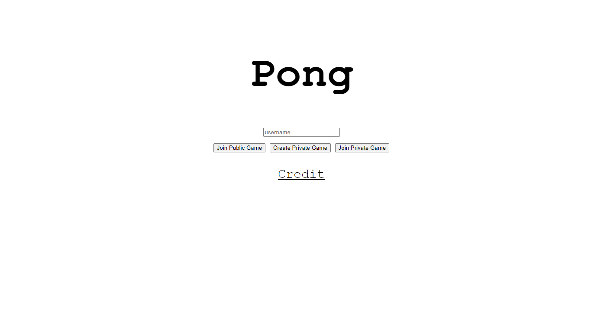
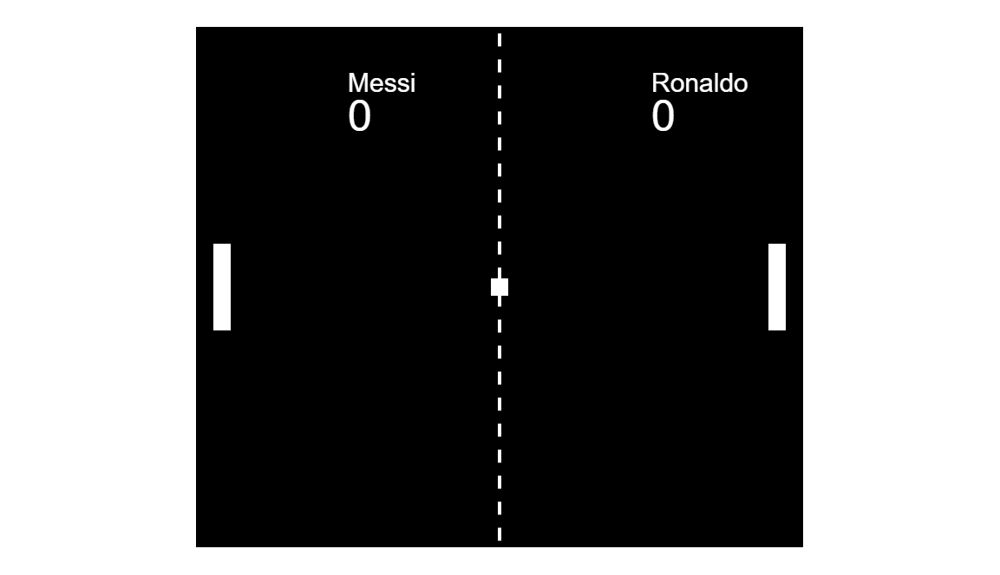

# Pong([video](https://www.youtube.com/watch?v=CAkqfaT20U8&t=34s&ab_channel=WoonggiEun))
Game server implementation with pong

~~The server was deployed on AWS but not it closed(due to the billing)~~

Server is back! You can access to http://44.236.180.253:3000/.

But you could still test locally. Clone the repository and run,

```
npm install
```
to download dependencies. And simply run the server
```
node server.js
```
Then open up your browser and connect to localhost with port number 3000.


This is the lobby screen.

#### Join Public Game
Click Join Public Game with a username, you join to the random game. If there's a player who is already waiting for another player, you would join that game right away. But if not, you will be on waiting another player to join.


#### Create Private Game
You can create a private game room with unique room code you make. If you want to play with your friend, you should let him/her know your room code.
This room code have to be unique, and if your room code is already exists, an error message will pop up.

#### Join Private Game
If you have a unique room code from your friend, you can simply type that room code and join your friend's room.

The game will look like this.



You can control with your up/down arrow keys and Space bar to start the game. Enjoy :)
